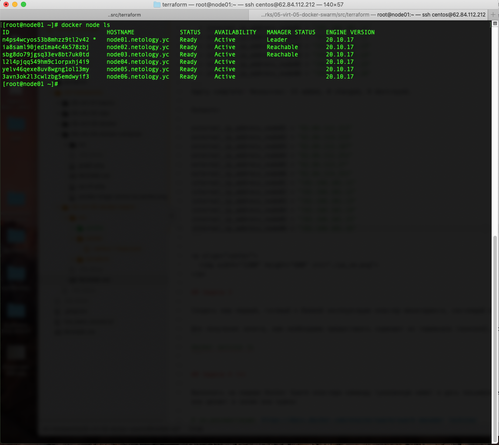
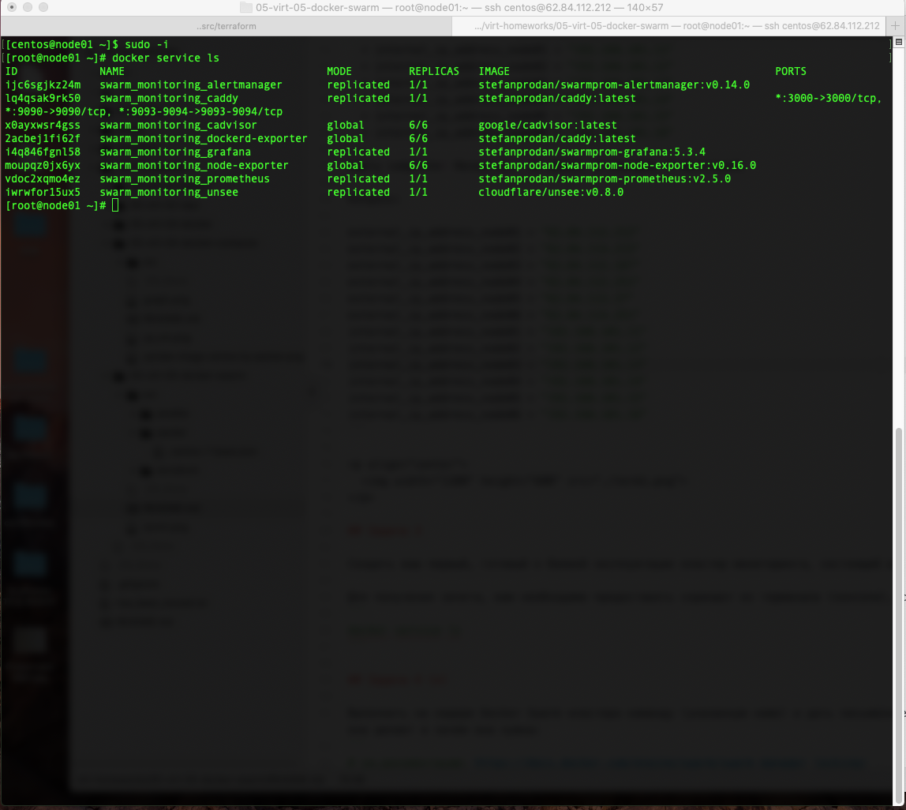
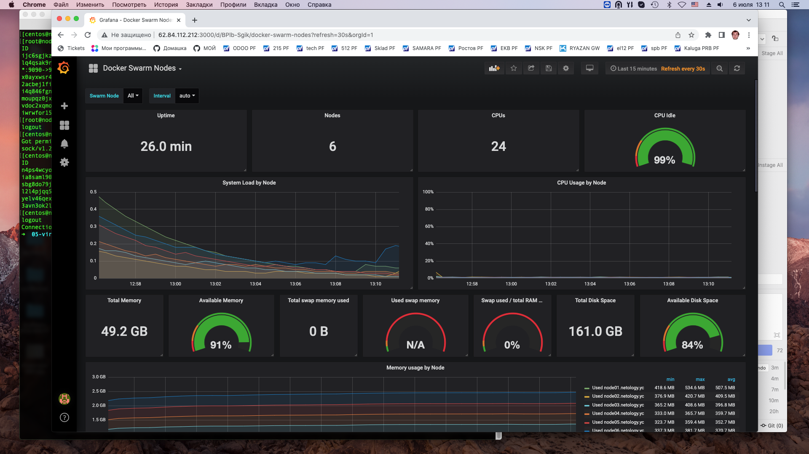

# Домашнее задание к занятию "5.5. Оркестрация кластером Docker контейнеров на примере Docker Swarm"

## Задача 1

Дайте письменые ответы на следующие вопросы:

- В чём отличие режимов работы сервисов в Docker Swarm кластере: replication и global?
```shell
replication будет запущено указанное пользователем количество экземпляров сервиса,
но их распределение не регламентируется
global будет запущено указанное пользователем количество экземпляров сервиса
и их распределение будет регламентированно
```
- Какой алгоритм выбора лидера используется в Docker Swarm кластере?
```shell
В Docker Swarm кластере используется алгоритм выбора лидера RAFT.

RAFT — алгоритм для решения задач консенсуса в сети ненадёжных вычислений.
```
- Что такое Overlay Network?
```shell
Overlay Network - общий случай логической сети, создаваемой поверх другой сети.
Overlay-сети используются в контексте кластеров (Docker Swarm), где виртуальная сеть,
которую используют контейнеры, связывает несколько физических хостов, на которых запущен Docker.
Когда вы запускаете контейнер на swarm-кластере (как часть сервиса), множество сетей
присоединяется по умолчанию, и каждая из них соответствует разным требованиям связи.
```

## Задача 2

Создать ваш первый Docker Swarm кластер в Яндекс.Облаке

Для получения зачета, вам необходимо предоставить скриншот из терминала (консоли), с выводом команды:
```shell
➜  terraform git:(main) ✗ terraform apply

Terraform used the selected providers to generate the following execution plan. Resource actions are indicated with the following symbols:
  + create

Terraform will perform the following actions:
...
Plan: 13 to add, 0 to change, 0 to destroy.

Changes to Outputs:
  + external_ip_address_node01 = (known after apply)
  + external_ip_address_node02 = (known after apply)
  + external_ip_address_node03 = (known after apply)
  + external_ip_address_node04 = (known after apply)
  + external_ip_address_node05 = (known after apply)
  + external_ip_address_node06 = (known after apply)
  + internal_ip_address_node01 = "192.168.101.11"
  + internal_ip_address_node02 = "192.168.101.12"
  + internal_ip_address_node03 = "192.168.101.13"
  + internal_ip_address_node04 = "192.168.101.14"
  + internal_ip_address_node05 = "192.168.101.15"
  + internal_ip_address_node06 = "192.168.101.16"
...
Apply complete! Resources: 13 added, 0 changed, 0 destroyed.

Outputs:

external_ip_address_node01 = "62.84.112.212"
external_ip_address_node02 = "62.84.114.215"
external_ip_address_node03 = "62.84.112.187"
external_ip_address_node04 = "62.84.112.251"
external_ip_address_node05 = "62.84.113.37"
external_ip_address_node06 = "62.84.114.251"
internal_ip_address_node01 = "192.168.101.11"
internal_ip_address_node02 = "192.168.101.12"
internal_ip_address_node03 = "192.168.101.13"
internal_ip_address_node04 = "192.168.101.14"
internal_ip_address_node05 = "192.168.101.15"
internal_ip_address_node06 = "192.168.101.16"
```

<p align="center">
  
</p>

## Задача 3


<p align="center">
  
</p>


<p align="center">
  
</p>


## Задача 4 (*)

Выполнить на лидере Docker Swarm кластера команду (указанную ниже) и дать письменное описание её функционала, что она делает и зачем она нужна:
```shell
[centos@node01 ~]$ sudo docker swarm update --autolock=true
Swarm updated.
To unlock a swarm manager after it restarts, run the `docker swarm unlock`
command and provide the following key:

    SWMKEY-1-c02B1pSjmL0lLwdylEBzPYHqK+nS1PNY6QsDquZf2Xw

Please remember to store this key in a password manager, since without it you
will not be able to restart the manager.

[centos@node01 ~]$ sudo service docker restart
Redirecting to /bin/systemctl restart docker.service
[centos@node01 ~]$ sudo docker service ls
Error response from daemon: Swarm is encrypted and needs to be unlocked before it can be used. Please use "docker swarm unlock" to unlock it.

# см.документацию: https://docs.docker.com/engine/swarm/swarm_manager_locking/
```


###This at-rest encryption protects your service’s configuration and data from attackers who gain access to the encrypted Raft logs.

```shell
[centos@node01 ~]$ sudo docker swarm unlock
Please enter unlock key:
[centos@node01 ~]$ sudo docker service ls
ID             NAME                                MODE         REPLICAS   IMAGE                                          PORTS
ijc6sgjkz24m   swarm_monitoring_alertmanager       replicated   1/1        stefanprodan/swarmprom-alertmanager:v0.14.0    
lq4qsak9rk50   swarm_monitoring_caddy              replicated   1/1        stefanprodan/caddy:latest                      *:3000->3000/tcp, *:9090->9090/tcp, *:9093-9094->9093-9094/tcp
x0ayxwsr4gss   swarm_monitoring_cadvisor           global       6/6        google/cadvisor:latest                         
2acbej1fi62f   swarm_monitoring_dockerd-exporter   global       6/6        stefanprodan/caddy:latest                      
i4q846fgnl58   swarm_monitoring_grafana            replicated   1/1        stefanprodan/swarmprom-grafana:5.3.4           
moupqz0jx6yx   swarm_monitoring_node-exporter      global       6/6        stefanprodan/swarmprom-node-exporter:v0.16.0   
vdoc2xqmo4ez   swarm_monitoring_prometheus         replicated   1/1        stefanprodan/swarmprom-prometheus:v2.5.0       
iwrwfor15ux5   swarm_monitoring_unsee              replicated   1/1        cloudflare/unsee:v0.8.0        
```

---

### Как cдавать задание

Выполненное домашнее задание пришлите ссылкой на .md-файл в вашем репозитории.

---
